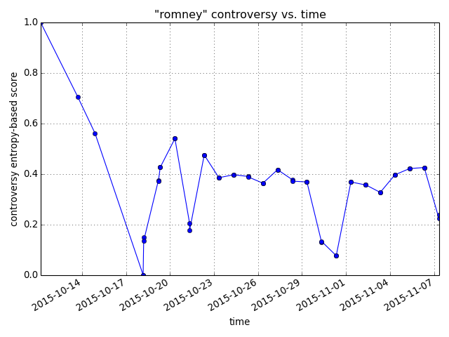

.. |---| unicode:: U+2014 .. em dash

Controversy project API
~~~~~~~~~~~~~~~~~~~~~~~

If you're viewing this page on GitHub, please consider switching to our HTML version here: https://docs.controversy.2pitau.org

.. note::

	This specification is for mostly for internal reference only. We currently do not have a method for scoring external articles.
	
	Prefix all URLs with ``//controversy.2pitau.org``.

Trends
------

**GET** ``/api/trend``

.. include:: documents/trend.json
	:code: javascript
	:number-lines:

Where ``['result']['trending']`` is a key-value pair list where the key is the query and the value is the amount of search traffic towards that query. ``['result']['top-5']`` is a ranked list of the most popular queries. ``top-5`` will always be a (non-proper) subset of trending.

``/api/trend/<k>``. Where ``<k>`` is an element of ``/api/trend``'s ``trending`` list (a keyword that's been searched for before).

.. include:: documents/trendk.json
	:code: javascript
	:number-lines:
	
**GET** ``/api/trend/<k>.png`` will generate a trendline (if there's enough data) of the controversy of a keyword versus time. Here's an example (not based on the ``json`` above):

If you don't want a normalized plot, do ``<k>.png?nonorm``.

You must be logged in to query any of the *below* endpoints (i.e. trends don't require logins).

Errors
------

``UsageError``
        ``error`` will be ``1``, ``message`` will have an error message, ``400`` status code
other error
        same, except with a ``200``. e.g.: no articles exist for the queryterm

Article rank
------------

**GET** ``/api?q=syria``

.. include:: documents/syria-spec.json
	:code: javascript
	:number-lines:

    
Where ``score`` is the score (defined in the IEEE paper) for an article or keyword. It's the sum of the sentiment and lingustic scores.

User search-history
-------------------

**GET** ``/api/user-history``. It's only possible to query the currently-signed-in user's history, so no arguments.

.. include:: documents/user-history.json
	:code: javascript
	:number-lines:

